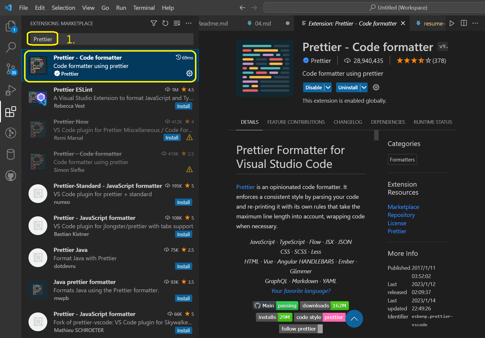
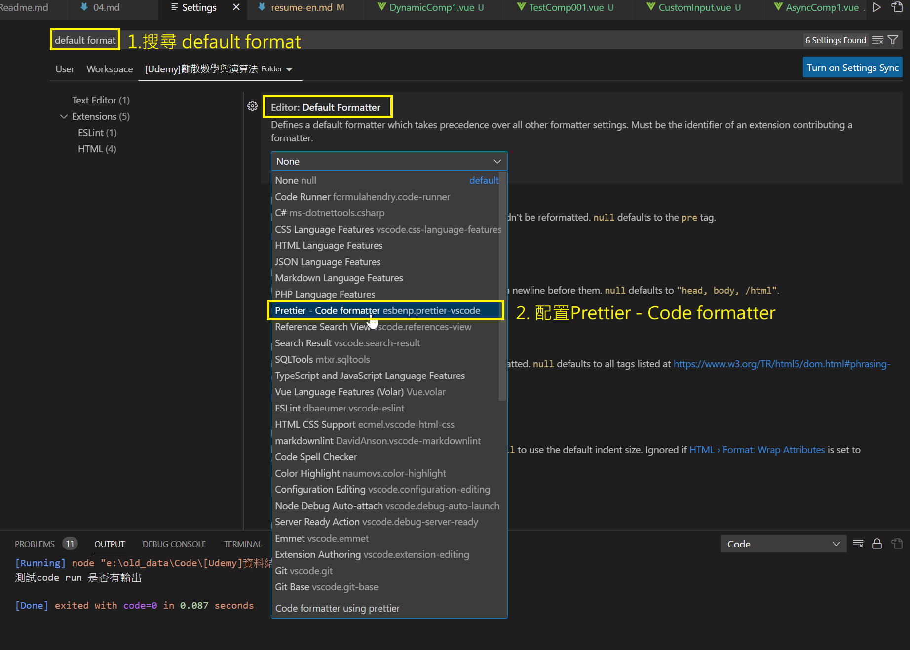

# Prettier

code formatter, 用途是幫code排版變整齊

1. 到 VS Code extensions 安裝 [Prettier](https://marketplace.visualstudio.com/items?itemName=esbenp.prettier-vscode)

    

2. 到 VS code 設定,搜尋 `format` 找到 `Editor: Default Formatter`  
   確認 Prettier 已經設定上去

   

> PS. 詳細可以參考Prettier官方說明
