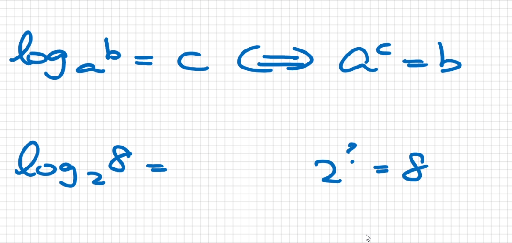
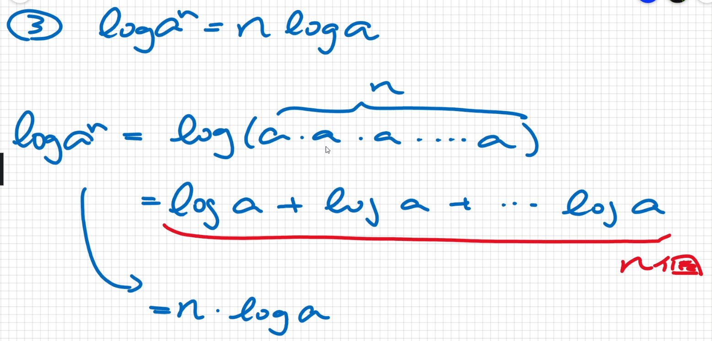

# Log Review

`log` 說明: 後續演算會需要用到

1. log $a^b$ = c <--> $a^c$ = b  
    ex:  
        log $2^8$ = 3  
        log $10^{100}$ = 2

2. log a + log b = log (ab)  
    ex:  
        log $2^8$ + log $2^{16}$ = log $2^{8*16}$ = log $2^{128}$  
    

3. log a - log b = log $\frac{a}{b}$  
4. log $a^n$ = n x log a  
    
