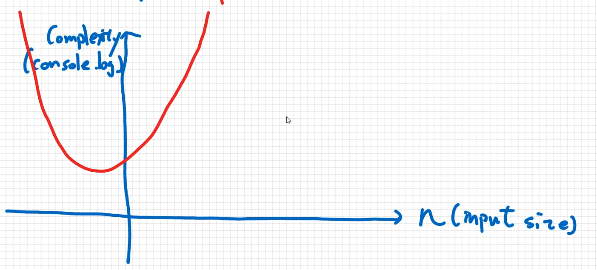
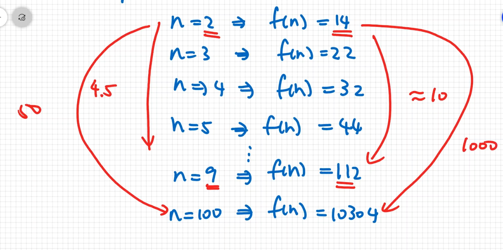

# Complexity

## What is Complexity?

* When analyzing the complexity of an algorithm,  
  we calculate the (time or space) complexity.
* Generally, every addition, subtraction, multiplication,  
  division, comparision counts as one "operation".  
  (基本上都是加,減,乘,除與比較的操作)
* Complexity means give an input size,  
  "how many operations do we need to perform in an algorithm?"  
  (Complexity定義是指定一個input size,共用到多少個operations, operation越多,花費時間也越多)
* We use function f(n) to show the equation of complexity and input sizes.  
  (通常會用一個f(n)表示複雜度與input size的關係)  

  ```javascript
  function example(n) {
    for (let i = 0; i < 3 * n; i++) {
      console.log('Hello');
    }

    for (let i = 0; i < n; i++){
      for (let j = 0; j < n; j++) {
        console.log('Hello');
      }
    }

    console.log('Hello');
    console.log('Hello');
    console.log('Hello');
    console.log('Hello');
  }

  example(2); // console.log幾次? 3*n + n^2 + 4, n = 2 => 14次
  // [Complexity]: f(n) = n^2 + 3n + 4
  ```

  `f(n)` and `n` have quadratic relations.
  

  
