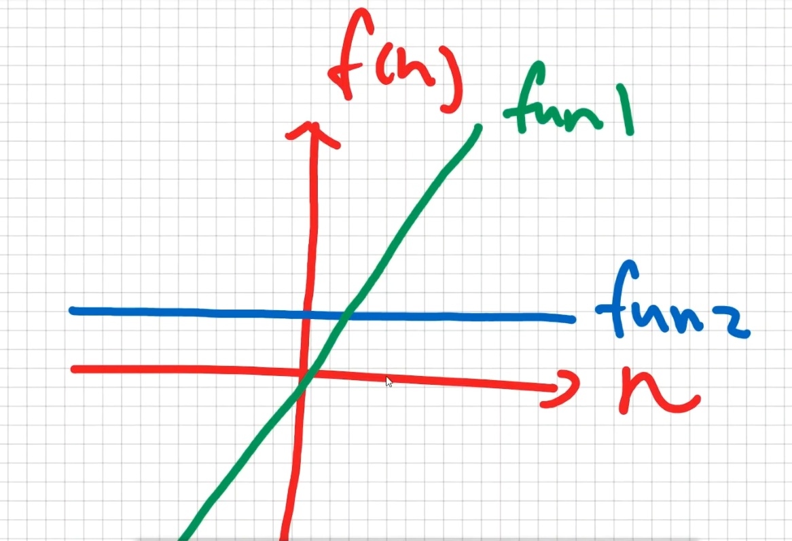

# Analysis of fun 1 and fun 2

## 說明 fun1 和 fun2

計算複雜度就是要算出有多少個 operations

* 以 `fun1` 來說,複雜度至少有3次 * n  
  `f(n) = 3n`, operation如下:
  1. `i <= n`
  2. `i++`
  3. `sum += i`

* 以 `fun2` 來說,不論 `n = 100` 或 `n = 10000000`,複雜度都只有3  
  `f(n) = 3`,operation如下:
  1. (1 + n)
  2. 前面的結果 * n
  3. 前面的結果 / 2

```javascript
// 1 + 2 + 3 + ... + n = sum 
function fun1(n) {
  let sum = 0;
  for (let i = 1; i <= n; i++) {
    sum += i;
  }
  return sum;
}

function fun2(n) {
  return ((1 + n) * n) / 2;
}
```

## 線性圖
當 `n` 很小的複雜度還好,但當 `n` 越來越大時,`fun1`和`fun2`複雜度會差異越來越大
