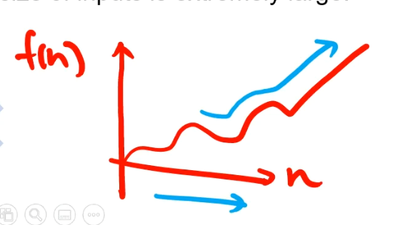

# Big O Notation

* Big O Notation is a tool that describe the limiting  
  behavior of a function when the argument tends towards a particular value or infinity.  
  (Big O Notation是一個工具,用來描述當`n`不斷變大時的`f(n)`的走向, argument 指的是 input)  
  
* Big O Notation has a "worst case scenario", which means  
  it shows the general trends of complexity when the size of inputs is extremely large.  
  (通常在考慮 Big O Notation 指的就是最糟糕的情況是什麼, 當輸入越來越大時,展示其演算法複雜度的成長趨勢)

## Calculating Big O Value (計算 Big O 的規則)

1. Constant doesn't matter  
   (常數不重要,常數就是不變的數)  
    > ex: f(n) = 3n  
      3就是常數, n就是變數
2. Small Terms don't matter  
   (比較小的terms可以忽略)  
   > f(n) = $\cancel{3}n^2$ + $\cancel{6n + 4}$  
     因為 $3n^2$ 最大, 所以後面 6n + 4 都可忽略不考慮
     因為第一個規則可不考慮常數,所以 $3n^2$ 可以不考慮 3  
     所以 Big O Notation = O($n^2$)
3. Logarithm Base doesn't matter  
   (當log base為2時, 可省略 2)  
   > ex: log $_{2}8$ = 3 => 2就是base  
     f(n) = log $_{2}n$ => O(log n)

## Example 1

Given an algorithm that has time complexity f(n) = 2n,  
what the big O of this algorithm ?
(若某演算複雜度為 f(n) = 2n, 其BigO 為多少?)
> 依據第一個規則可忽略常數, 所以Big O = O( $\cancel{2}$ n) = O(n)

## Example 2

Given an algorithm that has time complexity f(n) = 13 $n^3$ + 6n + 7,  
what's the big O of this algorithm ?
(若某演算複雜度為 f(n) = 13 $n^3$ + 6n + 7, 其BigO 為多少?)
> 依據第一個規則和第二個規則可忽略較小的terms  
  所以Big O = O($\cancel{13} n^3 + \cancel{6n + 7} $) = O($n^3$)

## Example 3

Given an algorithm that has time complexity f(n) = 4 log $_2n$,  
what's the big O of this algorithm ?
> 依據第一個和第三個規則  
  所以Big O = O($\cancel{4} log \cancel{_2}n$) = O($log n$)

## Example 4

Given an algorithm that has time complexity f(n) = 5,  
what's the big O of this algorithm ?
> 任何規則都不適用,  
  所以 Big O = O(5) <= 這是錯誤的  
  當 f(n) = 3n => 其實是將 3 化為 1 => f(n) = 1n => f(n) = n
  所以真正的 Big O = O(1)才是正確的解答

## Common Big O of Algorithm

常見的Big O 值(從上到下為好到差排列):

1. O(1)
2. O(log n)
3. O(n)
4. O(n log n) <= sorting很常 使用
5. O($n^2$)
6. O($n^3$)
