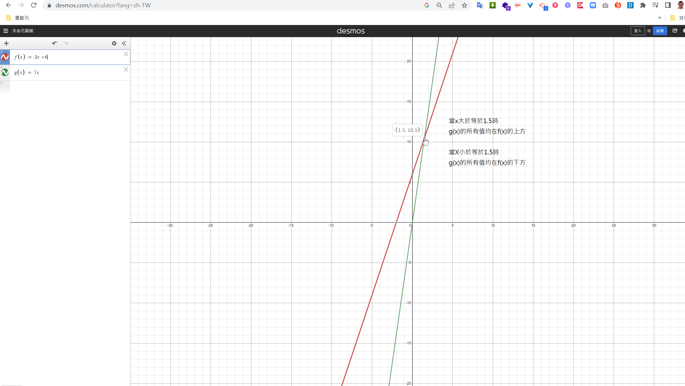
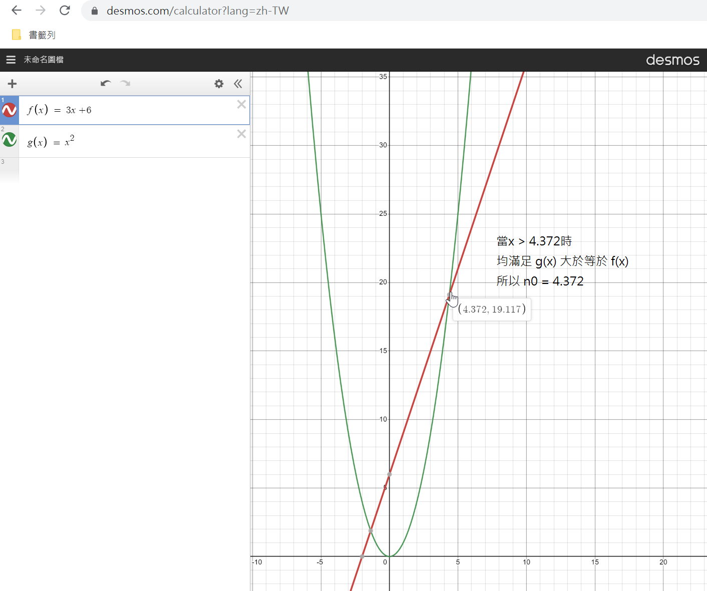
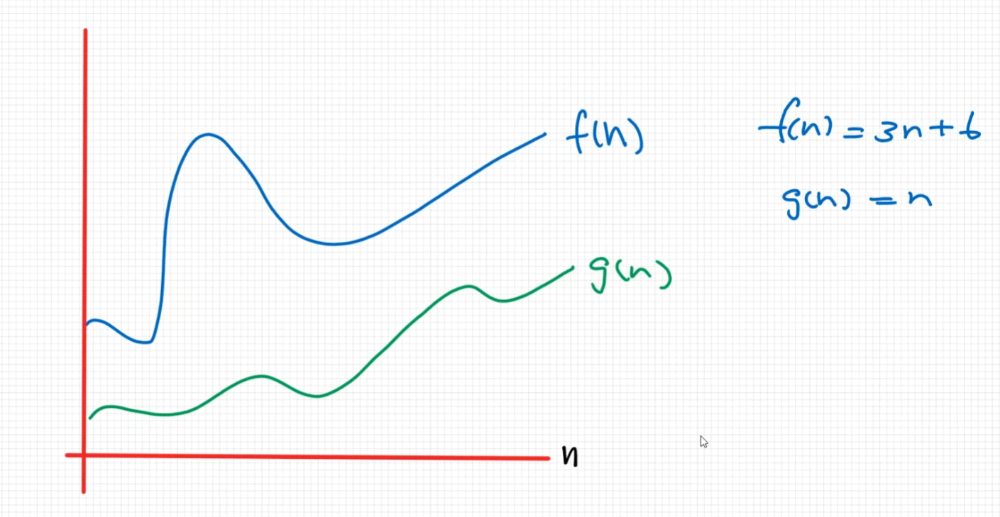
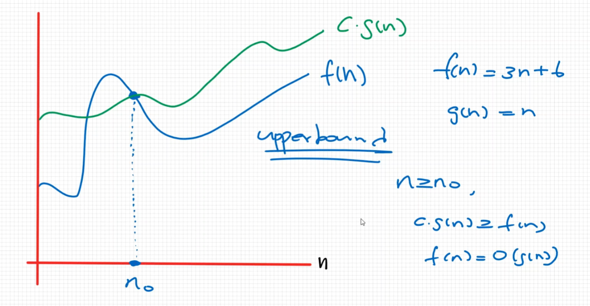

# Understanding Big O Notation (Formal Definition)

## Asymptotic Notation

1 < $log n$ < $\sqrt{n}$ < n < $ n log(n) $ < $n^2$ < $n^3$ < ... < $2^n$ <
$3^n$ < ... < $n^n$  

### Big O 定義(找 upper bound)

The function $f(n)$ = $O(g(n))$ iff ∃ c, n0  
st. $0 \le f(n) \le c \times g(n)$, ∀ $n \ge n0 $

> 有個函式$f(n)$ = $O(g(n))$,且存在一個數c和n0,  
使得 $0 \le f(n) \le c \times g(n)$, 且對於所有的n為 $n \ge n0 $  
這樣我們就會稱 $f(n)$ = $O(g(n))$

範例1:  
$f(n) = 3n + 6 , c = 7 , g(n) = n$ , n0為多少?  
由題目可推論出 $c \times g(n) = 7n$ ,接下來看 `3n + 6` 與 `7n` 在座標平面上有什麼關係?  
用 [desmos](https://www.desmos.com/calculator?lang=zh-TW)將圖形畫出,如下:  

所以 n0 = 1.5, 對於所有的 $n \ge n0$ , 且 $c \times g(n) \ge f(n) $  
所以 $f(n) = O(g(n))$, 又因 $g(n) = n$ , 所以 $f(n) = O(n)$ .  
結論: f(n) = 3n + 6 = O(n)  
c值會影響n0的值,但c值不管是啥,都不會影響 $f(n) = O(n)$ 這個結論

> 解釋:  
>
> - iff: if and only if
> - A倒過來的符號: `∀`, 表示`任一`的意思, `any`, ex: ∀x＞0, 表示任意x > 0
> - E過來的符號: `∃`表示`存在`,或是說至少有一個, ex: ∃x＞0, 表示存在x > 0

範例2:  
$f(n) = 3n + 6$, $c = 1$, $g(n) = n^2$  
此時的 $c \times g(n) = n^2$  
這兩個函數的座標圖如下(觀察第一象限即可):  

$n0 = 4.372$  
$∀ n \ge n0$ 的情況下  
$c \times g(n) \ge f(n)$: (從上圖可證實)  
所以 $f(n) = O(g(n))$,  
又因 $g(n) = n^2$  
所以  $f(n) = O(n^2)$

以上範例發現函數 $f(n) = 3n + 6 = O(n) = O(n^2)$  
當 $O(n)$ 和 $O(n^2)$ 都是對的時,應該選擇 $O(n)$  
才能比較正確反應出函數 $f(n) = 3n + 6$ 的特性

## 結論

Big O的值要越小且越接近函數還能正確反應函數特性

一開始的 f(n) 和 g(n)

當g(n)乘上 c 設法逼近f(n),然後設法找到某個值n0,讓所有的 $n \ge n0$ (這是目標)  
這時 $c \times g(n) \ge f(n)$ ,那我們就可以說 $f(n) = O(g(n))$
當n的值不斷變大, f(x) 和 $c \times g(n)$ 也都不斷變大,
但 f(n) 永遠不會超過 $c \times g(n)$ , 所以這時候的 f(n) 就定義了 `Upper bound` (最高邊界), 也就是說他不會超過某個值  
$c \times g(n)$定義了函數f(n) 的 `upper bound`  
所以我們稱這個 Big O Notation 定義一個函數的 `upper bound` 的 behavior 是什麼.
