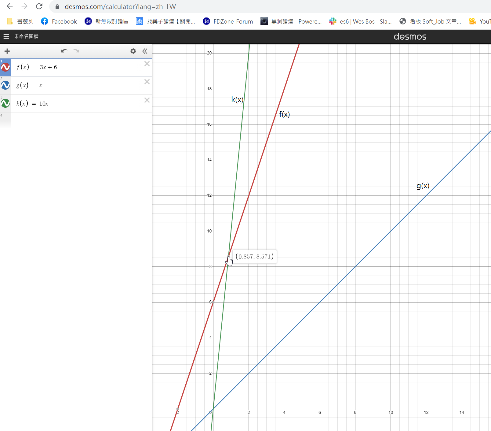

# Understanding Big O Notation

## Big Omega(找 lower bound)

1 < $log n$ < $\sqrt{n}$ < n < $ n log(n) $ < $n^2$ < $n^3$ < ... < $2^n$ <
$3^n$ < ... < $n^n$  

Big Omega 定義很類似 Big O 的定義, 定義如下:  
$f(n) = \Omega(g(n))$ iff ∃ real number c, n0 (若且唯若存在者 real number c, n0)  
s.t. $f(n) \ge c \times g(n) \ge 0$ , ∀ $n \ge n0 $  
(使得此函數 $f(n) \ge c \times g(n) \ge 0$成立, 且所有的n均大於等於 0, 我們就可以說 $f(n) = \Omega(g(n))$)

範例1:  
$f(n) = 3n + 6$ 我們假設 c = 1, $g(n) = log n$  
所以目前有兩個函數 $f(n) = 3n + 6$ 和 $c \times g(n) = log n$  
座標關係如下:  
  
假設n0 = 0時, 且 $n \ge n0$,  
這時 $f(n) \ge c \times g(n)$ 是成立的,  
所以我們可以說 $f(n) = \Omega(g(n))$ 也是成立的,  
但因 $g(n) = log n$  
所以 $f(n) = \Omega(log n)$  
這時我們可以知道 Big Omega所代表的其實是和 Big O定義相反的  
他要找的是 `lower bound`,也就是最低限度是什麼  
為什麼我們需要知道一個演算法的 Big Omega的值是多少呢?  
因為這可以知道不論如何改進一個函數(幫助演算法更好),總會有個臨界值使得此函數無法再更好了,也就是了解改進後最好的狀況是什麼.  
例如: Insertion Sort演算法的 Big O = $O(n^2)$ , Big Omega = $\Omega(n)$  
也就是時間複雜度最少的狀況是 $\Omega(n)$ , 這就是它的極限.

範例2:  

$f(n) = 3n + 6$ 我們假設 c = 1, $g(n) = n$  
假設n0 = 0時, 且∀ (所有的) $n \ge n0$ 且 $f(n) \ge c \times g(n)$  
所以 $f(n) = \Omega(g(n)) = \Omega(n)$  
也就是說  $f(n) = 3n + 6 = \Omega(n) = \Omega(log n)$  
也可以找到某個c值來使 $\Omega(1)$ 成立  

## Big Theta

若某個函數為 $f(n) = \theta(g(n))$ iff ∃ positive real number c1, c2, n0 (若且唯若存在者實數c1, c2, n0)  
s.t. $0 \le c1 \times g(n) \le f(n) \le c2 \times g(n)$ , ∀ $n \ge n0 $  
(使得此函數f(n)滿足 $0 \le c1 \times g(n) \le f(n) \le c2 \times g(n)$, 我們就可以說 $f(n) = \theta(g(n))$)

範例1:  
$f(n) = 3n + 6$ 我們假設 c1 = 1, c2 = 10, $g(n) = n$  
這時有3個函數 $f(x) = 3x + 6$ 和 $ g(x) = c1 \times g(x) = x$ 和 $k(x) = c2 \times g(x) = 10x$, 如下圖所示:  

我們發現當 $ x \ge 0.857$, 就會知道 $f(x)$ 的值會介於 $g(x)$ 和 $k(x)$ 之間  
這時就會稱 $f(n) = \theta(x)$  
  
也就是說圖中間的 $n = \theta(n)$
