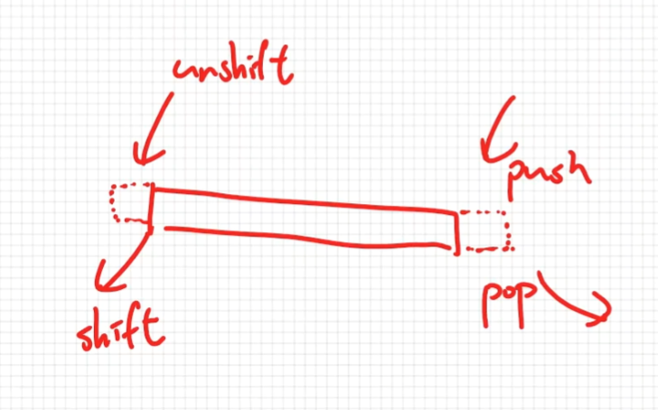

# Analysis of Arrays and Objects

針對以下4種作處理:

  1. Insertion(加入資料)
  2. Removal(移除資料)
  3. Searching(找查某一筆資料)
  4. Access(從某個Array或object將資料提取出來)

## Big O Analysis - Objects and Arrays

### Objects(JavaScript)

Complexity如下:

  1. Insertion: $O(1)$
  2. Removal: $O(1)$
  3. Searching: $O(n)$
  4. Accessing: $O(1)$  
     假設有兩個object, obj1, obj2,  
     obj1裡面有非常多的屬性, obj2則只有一點點屬性,  
     當嘗試取得 obj1.xxx 和 obj2.xxx 時, 誰比較快?  
     答案是一樣快,原因是因為JavaScript的object有hash table的演算來幫助取得屬性

### Array(JavaScript)

Complexity如下:

  1. Insertion:
      - `push`: $O(1)$
      - `unshift`: $O(n)$  
        說明: array裡面每筆資料都有個index number,  
        當需要在開頭加上一筆資料,其實需要異動整個陣列所有的index  
        造成異動後的複雜度是整個陣列長度也就是 $O(n)$
  2. Removal:
      - `pop`: $O(1)$
      - `shift`: $O(n)$ (狀況類似`unshift`)
  3. Searching: $O(n)$
  4. Accessing: $O(1)$ (也因為hash table的關係)  
     假設從兩個不同陣列找尋不同索引的值,誰比較快?  
     arr1[999], arr2[9] 誰快?  
     一樣因hash table的演算關係,所以兩個都是 $O(1)$



## 計算複雜度

以下時間複雜度為 $O(n)$

```javascript
let n = 5;
let arr = [1, 3, 5, 7, 9];

for (let i = 0; i < n; i++) {
  arr.push(10);
}
console.log(arr);
```

以下時間複雜度為 $O(n * n) = O(n^2)$

```javascript
let n = 5;
let arr = [1, 3, 5, 7, 9];

for (let i = 0; i < n; i++) {
  arr.unshift(10); // 因為這裡每次都會是 O(n) 了
}
console.log(arr);
```
