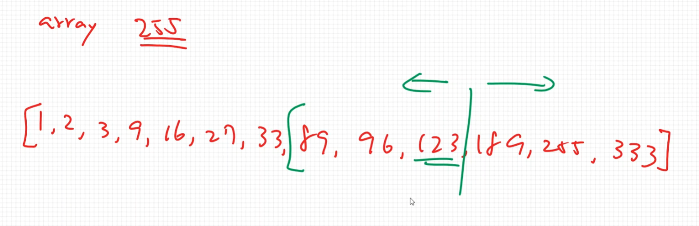
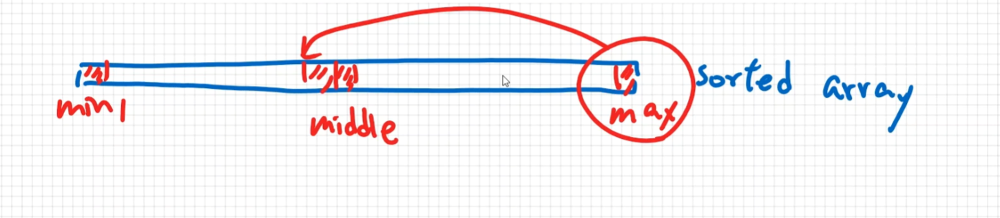
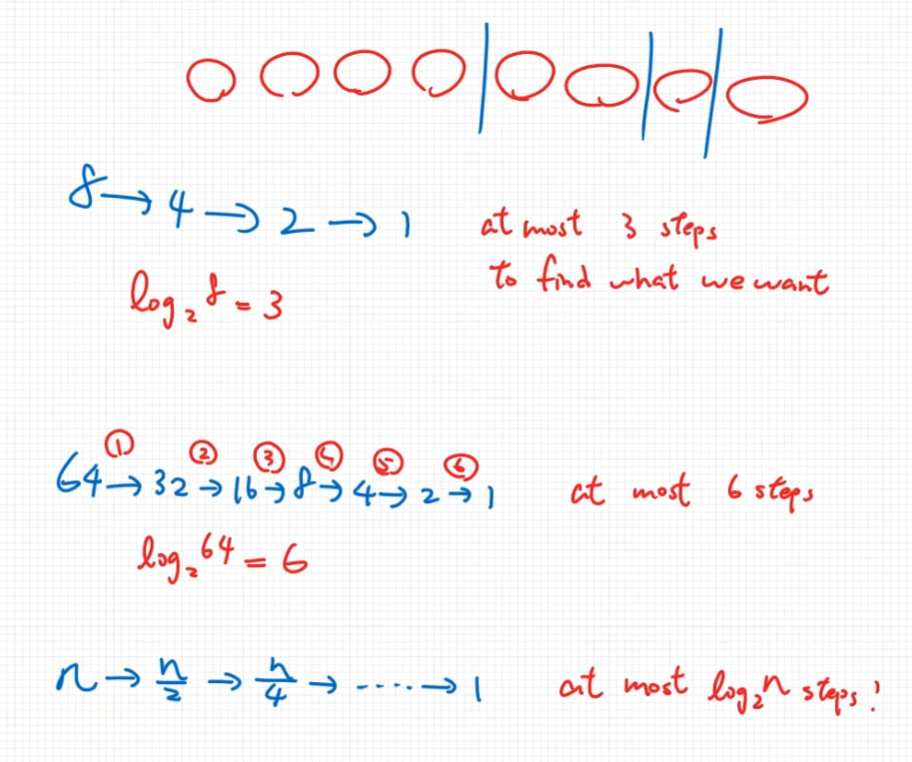

# Binary Search

- Binary search is a search algorithm that finds the position of a target value within a **sorted array**.
- More efficient than linear search, but only works with **sorted** data set.

若陣列已經排序過(由小到大),如何更快地找到元素 `n` 呢?  
先將陣列一次分成一半,然後要匹配的元素 `n` 和分一半時的中間值比較誰比較大,  
若要匹配的值比較大,就知道左半邊一定都比 `n` 小,所以只有右半邊有可能匹配,
然後繼續剛剛的右半邊再切一半,再比較一次誰大,  
若要匹配的值比較小,就知道右半邊一定都比 `n` 大,所以只有左半邊有可能匹配,
然後繼續剛剛的左半邊再切一半,再比較一次誰大,直到找到匹配 `n` 或沒得切為止.



若使用 `linear search` 需要找到 `255` 這個元素需要12次,  
若使用 `binary search` 需要找到 `255` 這個元素只需要3次,  
所以 `binary search` 會快很多, 但必須先排序過.

## Pseudocode for Binary Search

```text
BINARY-SEARCH(array, num)
    min = 0
    max = array.length - 1
    while min <= max:
        middle = (min + max) / 2
        if num > array[middle]:
            min = middle + 1
        else if num < array[middle]
            max = middle - 1
        else
            return middle
    return -1
```

為什麼需要 `min`, `max`來記錄頭尾索引呢?  
因為需要透過 `min` 和 `max` 來取得兩者的中間點 `middle`  
然後看看要匹配的值是在 `middle` 的**左邊**還是**右邊**或是剛剛好匹配到,
若在**左邊**則縮減 `max`, 讓 `max` 往左靠,所以就會把 `max` 替換成剛剛的 `middle - 1`  
若在**右邊**則縮減 `mix`, 讓 `min` 往右靠,所以就會把 `mix` 替換成剛剛的 `middle + 1`  
若剛好等於 `middle` 就表示找到了,那就返回該索引位置  
若上面的循環都找完還沒找到,就返回 `-1` 表示**找不到**匹配的值.



## Practice

[範例JS](./21-1.js)

## Overview

- Worst Case Performance: $O(log n)$ (就是不斷的對半分到最後)
- Best Case Performance: $O(1)$ (就是第一次就找到了)
- Average Performance: $O(log n)$


因為每次都對半切,所以就會是 $log _{2}n$ 個步驟
