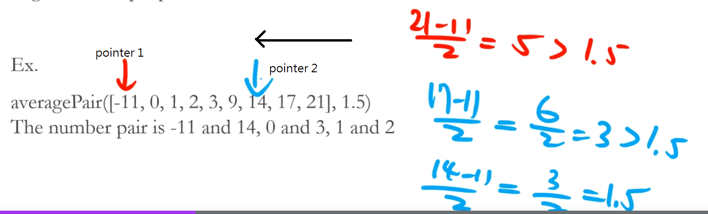

# Coding Practice - Average Pair

Write a function that given a sorted array of integers and a number.  
Find if there's any pair in the array that has average of the given number.  
Find all of them.  
There might be multiple pairs fit the condition.  
(寫一個function,有兩個參數,第一個是排序過的整數陣列,第二個是一個數字,從陣列中找到兩個數字的平均值是等於第二個參數)

Ex.  
averagePair([-11, 0, 1, 2, 3, 9, 14, 17, 21], 1.5); // the number pair is -11 and 14, 0 and 3, 1 and 2

以上述陣列來說其pair的組合是 $C^{9}_{2}$ = $ 9 \times 8 \over 2$ = 36種組合  
每次都把當時的值和後續的值去配對看看, 所以取第一個去配對看看剩餘的 n - 1 個,  
8 + 7 + 6 + ... + 1 種組合
如果配對成功就紀錄,但此演算複雜度(非最佳解): $O(n^2)$

[演示JS](./26.js)

## Pointer(複雜度: $O(n)$ )

- This is a general skill when doing algorithm design.  
Pointer is not formal name.  
  Name is different, but the idea is the same everywhere.
- It helps reduce the complexity of algorithms.

(Pointer就是箭頭的意思,利用指標[依情境會有多個指標])

首先題目說這是一個排序過的整數陣列,可以利用兩個指標一個指向當前的值,一個指向另一個值,  
左邊指標和右邊指標不斷的往內縮並檢查是否有配對,有配對就紀錄起來.  


---
My solution:

1. 把第二個參數(平均值) x 2 還原回目標數字 => (A + B) / 2 = 平均值 => B(目標整數) = (平均值 * 2) - A
2. 用一個object來記錄每次loop的目標整數 => 目標整數 = 平均值 * 2 - 當時整數
3. 每次loop檢查此object的key是否存在,若存在就表示有pair,那就把pair存入結果陣列

```javascript
function averagePair(arr, average) {
  const result = [];
  const obj = {};

  for (let num of arr) {
    const targetNum = average * 2 - num;// 目標整數 = 當前整數 - (平均值 * 2)
    // hit target
    if (Object.hasOwn(obj, num)) {
      result.push([targetNum, num]);
    } else {
      obj[targetNum] = 1; // 只需要key當作目標整數
    }
  }

  return result
}
```
