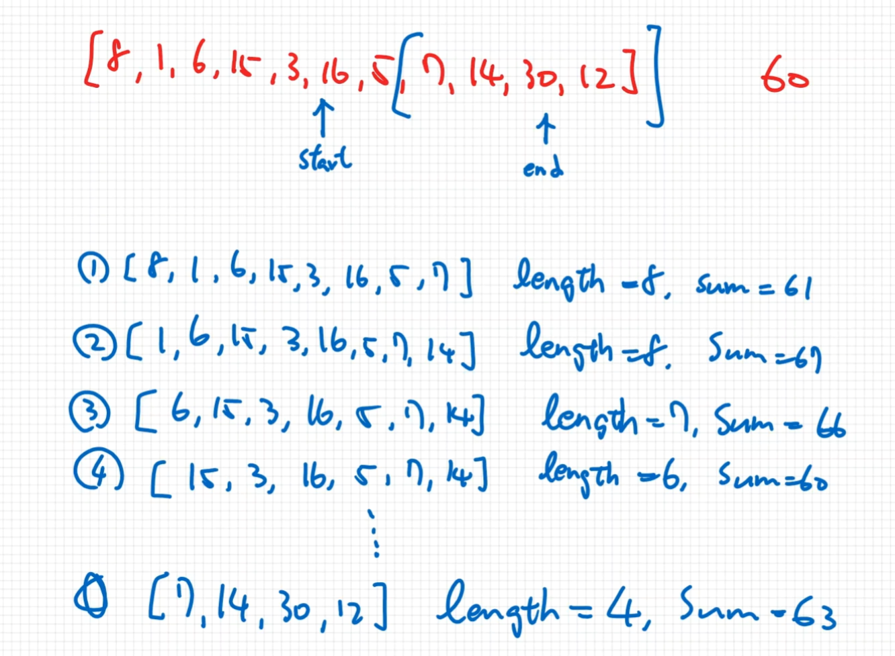

# Coding Practice - Min sub array length

Write a function called `minSubLength` which accepts two parameters,  
an array of positive integers and a positive integer.  
length of a continuous sub array - the sum of elements inside this sub array has to be greater than or equal to the positive integer parameter.  
If sub array not found, then return **0**.  
(寫一個方法傳入兩個參數, 一個是正整數的陣列, 一個是正整數的值.  
此方法可以找出陣列中最小長度的連續子陣列,且其總和大於第二個傳入參數,如果不存在此子陣列就返回0,否則返回該連續子陣列的長度)

[演示JS](./32.js)

Ex.  

```text
minSubLength([9, 8, 1, 4, 9, 5, 1, 2], 11); // 2 => [9, 8]

sub array:
[9], [8], [1], ...
[9, 8], [8, 1], [1, 4], ...
[9, 8, 1], [8, 1, 4], [1, 4, 9], ...

大於 11 的 sub array:
[9, 8], [4, 9], [9, 5] => length: 2
[9, 8, 1], [8, 1, 4], [1, 4, 9], [4, 9, 5], [9, 5, 1] => length: 3
...


以上sub array length最小的就是 2 
```

## 解題思路

**目標: 找出最小長度的連續陣列.**  
sliding window適合處理連續性的陣列問題.  
所以可利用 pointer + sliding window 來解此問題,  
兩個pointer, start和end指標和slide window的方式,檢查當前累積是否有超過目標值,  
**若沒有超過目標值**就右移end指標來累積當前的值(將window往右放大),  
**若有超過目標值**就檢查長度是否比上次小然後右移start指標來將window往右縮小.  



依據以上資訊自己寫的方法, 如下:

```javascript
function minSubLength(arr, target) {
  // 設定起始和結束位置
  let start = 0;
  let end = 0;
  let currentSum = arr[0]; // 當前的累積值
  let minLength = Number.POSITIVE_INFINITY; // 用來記錄上一次的最小陣列長度
  
  // 終止條件: 當end指標已經指到最後一個位置且當前累積值小於目標,因為扣掉start + 1的值就更不可能達到目標(陣列均正整數)了
  while (end < arr.length || currentSum < target) {
    console.log(`start:${start}, end:${end}, current_sum:${currentSum}`);
    // 若目前累積值小於目標, end + 1 且目前累積值也加上 end 索引位置的值
    if (currentSum < target) {
      end++;
      currentSum += arr[end];
    }
    
    // 若目前累積值大於或等於目標
    if (currentSum >= target) {
      const currentLength = end - start + 1; // 目前索引長度
      // 和上次紀錄的長度比較,若比較小就替換掉,否則就保留上次的
      minLength = currentLength < minLength ? currentLength : minLength;
      console.log('[hit]', minLength, currentLength);
      // 扣除本次的 start 索引位置的值並將 start + 1 (將sliding window往右移動一個單位)
      currentSum -= arr[start];
      if (start === end) end++;
      start++;
    }
  }
  
  // 若找不到就返回 -1
  if (minLength === Number.POSITIVE_INFINITY) {
    return -1;
  }

  return minLength;
}
```
