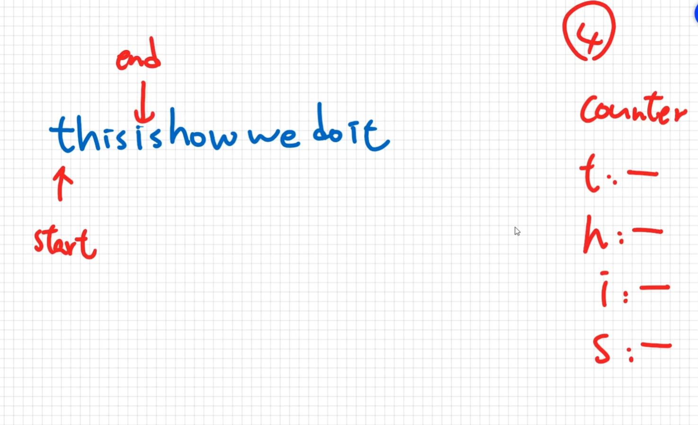

# Coding Practice - Unique Letters String

Write a  function called `uniqueLetterString`, which accepts a string and  
return s the length of the longest substring with all distinct characters.  
(寫一個方法,傳入一個字串,返回一個最長且全部不重複的字串長度)

Ex.

```text
uniqueLetterString('thisisshowwedoit'); // 6

// thisi => i重複了 => this => length:4
// sis => s重複了 => is => length:2
// showw => w重複了 => show => length:4
// wedoit => 沒了 => wedoit => length:6 => 這個是最長的字串
```

## 解題思路

需要用到 `sliding window` 和 `counter` 的技巧.  
利用兩個指標start和end, 每次loop都右移



[演示JS](./33.js)

## My Solution

依據以上提示,自己練習解的思路如下:

需要有個紀錄上次最大 length 的變數 `maxLength`,  
也需要有個 `Object` 紀錄每次所累積的 `最大且不重複` 的字串物件, `key` 用來記錄字母. value就隨意,  
每次loop檢查是否該次的字母是否已存在於累積用的物件,  
如果重複了, 就比較本次累積的物件key的數量和之前紀錄的誰比較大並且替換,然後本次 loop 再重新初始化此累積用的物件.  

```javascript
uniqueLetterString('thisisshowwedoit'); // 6

function uniqueLetterString(str) {
  // setup variable
  let maxLength = 0;
  let obj = new Set();
  
  // loop all character
  for (let ch of str) {
    // 若物件有記錄過此字母,就和上次紀錄的比較,若比較大就替換
    // 然後重新初始化紀錄用的物件,因為本次重複,所以初始化完畢後要再把本次的加入該物件紀錄
    if (obj.has(ch)) {
      console.log('obj', obj, ch);
      const currentLength = obj.size;
      if (currentLength > maxLength) {
        maxLength = currentLength;
      }
      obj.clear();
      obj.add(ch);
    } else {
      // 若物件沒有記錄過該字母就加入物件裡
      obj.add(ch);
    }
  }

  // 若最後一次loop都沒有重複上面loop檢查不了,所以需要檢查最後一次紀錄的set
  const currentLength = obj.size;
  if (currentLength > maxLength) {
    maxLength = currentLength;
  }

  return maxLength;
}
```
