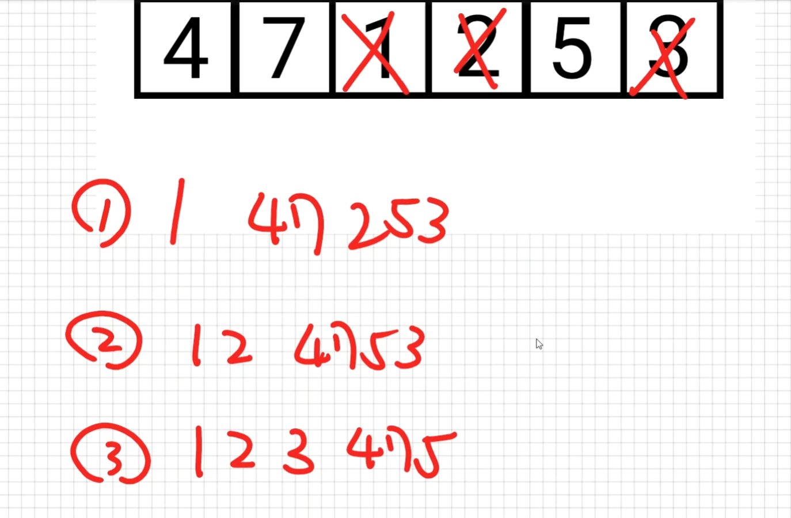

# Bubble Sort (氣泡排序法)

- Bubble sort compares adjacent elements and swaps them if they are in the wrong order.  
  (比較相鄰的元素然後交換這兩個相鄰的元素, 當條件順序是錯誤時)
- This simple algorithm performs poorly in real world use and is used primarily as an educational tool.  
  More efficient algorithms such as `quicksort`, or `merge sort` are used by the sorting libraries  
  built into popular programming languages such as Python and Java.  
  (此演算簡單,幾乎只有教學使用,現實上幾乎沒有使用,像是Python或Java使用的排序演算通常是 `quicksort` 或 `merge sort`)

## 演示

將此陣列 `[4, 7, 1, 2, 3, 5]` 由小到大排序:

```text
[4, 7, 1, 2, 3, 5] => 檢查最後兩個元素 3, 5 ,順序正確所以不用交換
[4, 7, 1, 2, 3, 5] => 往前移動一格檢查兩個元素 2, 3 ,順序正確所以不用交換
[4, 7, 1, 2, 3, 5] => 往前移動一格檢查兩個元素 1, 2 ,順序正確所以不用交換
[4, 7, 1, 2, 3, 5] => 往前移動一格檢查兩個元素 7, 1 ,順序不正確所以交換 => [4, 1, 7, 2, 3, 5]
[4, 1, 7, 2, 3, 5] => 往前移動一格檢查兩個元素 4, 1 ,順序不正確所以交換 => [1, 4, 7, 2, 3, 5]
以上陣列第一個元素排列完成了,所以接下來的排序可以跳過第一個了
(會把 1 這個值推到最前面)

接下來:
[1, 4, 7, 2, 3, 5] => 檢查最後兩個元素 3, 5 ,順序正確所以不用交換
[1, 4, 7, 2, 3, 5] => 往前移動一格檢查兩個元素 2, 3 ,順序正確所以不用交換
[1, 4, 7, 2, 3, 5] => 往前移動一格檢查兩個元素 7, 2 ,順序不正確所以交換 => [1, 4, 2, 7, 3, 5]
[1, 4, 2, 7, 3, 5] => 往前移動一格檢查兩個元素 4, 2 ,順序不正確所以交換 => [1, 2, 4, 7, 3, 5]
以上陣列第二個元素排列完成了,所以接下來的排序可以跳過第二個了
(會把 2 這個值推到前面,但會在1這個值的後方)

接下來依此類推每次loop都會把某個值往前推送, 
過程如同氣泡慢慢的往上升...
```

每一次的loop都會把某個值往前推送


## Pseudocode od Bubble Sort

```text
A is Array

BUBBLE-SORT(A):
  for i from 0 to A.length - 2(inclusive: 包含 A.length - 2 的這個值, 因為最後一個元素是不需要排序的)
      for j from A.length - 1 to i + 1(inclusive):
          if A[j] < A[j - 1]:
              swap A[j] and A[j - 1]
```

第一層 for loop 用來當做次數, 每跑完1次loop就會推送一個結果到前面,  
第二層 for loop 用來當作比較與交換,每跑完1次loop就會把本次相鄰的值排序

## JavaScript Code

[演示JS](./39.js)


## Overview of Bubble Sort

- Worst Case of Performance: $O(n^2)$  
  最差情況就是每一次都需要交換順序  
  交換次數的數列如下:  
  (n - 1) + (n - 2) + ... + (n - n)  
  = (n - 1) + (n - 2) + ... + 1 + 0
  = $(n - 1) \times n \over 2$  
  = $1 \over 2$ $n^2$ - $1 \over 2$ $n$  
  轉成 Big O 時捨去掉 $n^2$ 前面的常數和後面的一次數列  
  所以就只剩下 $n^2$
- Best Case of Performance: $O(n)$  
  假設已經由小到大排好順序了, 那就只要檢查一次是否有元素要交換,  
  因為沒有所以離開loop, 所以最佳情況就是跑一次陣列就結束了, 那Big O就是 $O(n)$
- Average performance: $O(n^2)$  
  因為其實有兩層 for loop 所以平均上來說幾乎是要跑 n * n 也就是 $O(n^2)$
