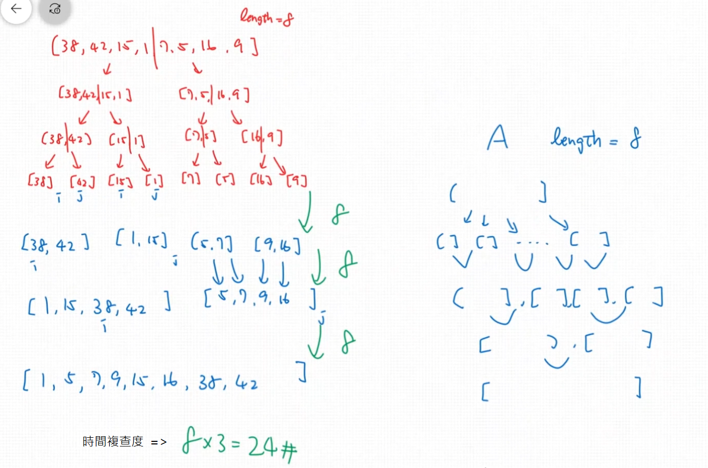

# Merge Sort (合併排序法)

- The principle of merge sort is quite simple.  
  Take advantage of the fact that combining two sorted arrays has $O(n)$ time complexity,  
  using the pointer skill.  
  (概念是利用合併兩個"**已經排序過的陣列**"和指標, 這樣時間複雜度只需要 $O(n)$ )
- This sorting algorithm is a classic  example of "divide and conquer".  
  (概念就是"分而治之")

## 範例說明

假設目前有一個未排序的陣列 [38, 42, 15, 1, 7, 5, 16, 9], 陣列長度為8.  

概念就是 "divide and conquer"(分而治之).  
所以第一步先將陣列從中間切一半(divide), 不斷的切直到不能切為止, 那切完的最小單位就是一個陣列裡面只有一個值, 此陣列就是已經排序好的.  
然後再利用兩個pointer不斷的合併兩陣列,最後就完成排序了.

```text
1.先分割成最小的陣列  
                [38, 42, 15, 1, 7, 5, 16, 9]
                              | (切半)
            [38, 42, 15, 1]      [7, 5, 16, 9]
                   |                  |
          [38, 42]    [15, 1]   [7, 5]    [16, 9]
             |           |        |          |
         [38] [42]   [15] [1]  [7] [5]   [16] [9]
--------------------------------------------------------
2.再利用2個 pointer 來倆倆合併排序後的陣列,合併過程也是依序合併
         [38, 42]     [1, 15]   [5, 7]    [9, 16]
                   |                    |
             [1, 15, 38, 42]       [5, 7, 9, 16]
                               |
                 [1, 5, 7, 9, 15, 16, 38, 42]                               

利用兩個 pointer 分別指向兩個陣列, 然後比大小再合併, 倆倆不斷的合併
[38] [42]
  i   j  (比較i和j所在的值,較小的放入陣列, 然後i或j再繼續往右移然後比較,直到兩個陣列的底部)
  [38, 42]

再接者比較 [15] [1], 方法同上 => [1, 15]
再接者比較 [7] [5], 方法同上 => [5, 7]
再接者比較 [16] [9], 方法同上 => [9, 16]
第一次的合併完成了,再來是第二次的合併
再接者比較 [38, 42], [1, 15] 方法同上 => [1, 15, 38, 42]
再接者比較 [5, 7], [9, 16] 方法同上 => [5, 7, 9, 16]
第二次的合併完成了,再來是第三次的合併
再接者比較 [1, 15, 38, 42], [5, 7, 9, 16] 方法同上 => [1, 5, 7, 9, 15, 16, 38, 42] 
合併完成了,也排序完成了.
```

## 範例的時間複雜度說明



最終有8個排序好的小陣列, 第1次合併後變成 4 個小陣列, 第2次合併後變成 2 個小陣列, 第3次合併後就變成1個陣列.  
8 -> 4 -> 2 -> 1  
合併動作要做幾次呢? (n:陣列長度)  
n -> $n \over 2$ -> $n \over 4$ -> ... -> (1 = $n \over 2^k$)  

> 1 = $n \over 2^k$ => $n \over 2^k$ => $2^k$ = n => $log_{2}n$ = k  
> 從n -> $n \over 2$ -> $n \over 4$ -> ... -> 1  總共經過了 **k** 次  
> 所以總共要合併 $log_{2}n$ 層, 每一層要合併 n 次,  
> 也就是 $n \times log_{2}n$ (時間複雜度)

剛剛的範例時間複雜度是 24 = 8 x $log_{2}8$ = 8 x 3  

## Pseudocode I of Merge Sort

此演算是將兩個排列好的陣列合併,合併後仍保持排列好的.  
首先準備一個空陣列,和兩個指標變數分別指向兩個陣列的頭,  
當兩個指標都超出兩個陣列的長度就表示排序完了,  
然後比較兩個指標 i,j 所指向的值,  
若 i 指標指向的值比較小,就將 i 指標的值推入用來記錄的空陣列,並且 i + 1 往右移動一格  
若 j 指標指向的值比較小,就將 j 指標的值推入用來記錄的空陣列,並且 j + 1 往右移動一格,  
當兩個指標到兩個陣列的底部就表示記錄用的空陣列完成兩個陣列的合併了(也排序好了).  

```text
MERGE(A1, A2):
    result = [], i = 0, j = 0
    while i < A1.length and j < A2.length:
        if A1[i] > A2[j]:
            add A2[j] to result
            j++
        else:
            add A1[i] to result
            i++
    // either arr1 or arr2 will have something left(假設某邊陣列有剩餘值)
    // use loop to put all remaining things into the result(也需要使用loop 將該陣列剩餘的值都放到result陣列中) 
```

## Pseudocode II of Merge Sort

此演算會結合上一個MERGE的演算,  
首先先遞迴將陣列切割到最小單位(已排序的陣列),  
然後利用Merge演算倆倆合併每次遞迴切割的陣列.

```text
MERGE-SORT(A):
    if A.length equals to 1:
        return A;
    else:
        middle = A.length / 2
        right = A.slice(0, middle)
        left = A.slice(middle, A.length)
        return MERGE(MERGE-SORT(right), MERGE-SORT(left))
```

## JavaScript Code

[演示JS](./42.js)

## Overview of Merge Sort

對於Merge Sort而言, 不論原本的陣列是已經大到小排列或小到大排列或隨機亂排,  
都先將陣列切到最小的單位,然後作合併,依據合併的次數來決定 log n 值,  
但需要注意的是Merge Sort需要的記憶體是比較多的, 因為每次分割和合併陣列都會產生新的陣列.  

- Worst Case Performance: O(n * log n)  
- Best Case Performance: O(n * log n)
- Average Performance: O(n * log n)
