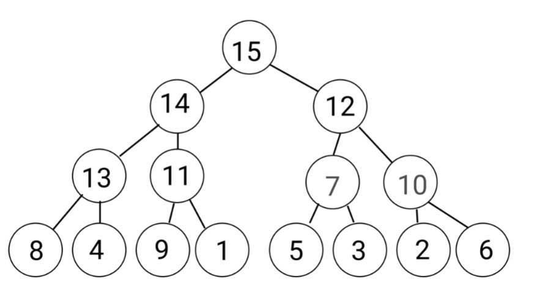

# Heap Sort (堆疊排序法)

## 前置知識

### Tree (Data Structure)

- In Computer science, a tree is widely used abstract data type that simulates a hierarchical tree structure,  
  with a root value and subtrees of children with a parent node,  
  represented as a set of linked nodes.  
  (是一個廣泛使用的抽象資料類型,用來模擬有分層的樹狀結構,會有最上層,第2層...等等)
- A tree should have only one root.(樹至少要有一個根節點)
- Another definition of tree is "tree is acyclic graph"(樹是一種沒有循環的"graph")

> "Directed Acyclic Graph"意思是沒有環，不走回頭路、永遠不回頭、不斷向前進, "樹" 就是一種["有向無環圖"](https://web.ntnu.edu.tw/~algo/DirectedAcyclicGraph.html)


### Binary Tree

- `Binary Tree` means each node has most two children, which are referred to as the left child and right child.  
  (`Binary Tree`中的任意node最多只能有兩個子node, 子node名稱為 left child 和 right child)
- `Complete Binary Tree` means an "almost-full" binary tree, the right most codes of the bottom might be missing.  
  (`Complete Binary Tree`是指各層節點全滿，除了最後一層，最後一層節點全部靠左。)  
  
- `Full Binary Tree` means a binary tree in which all leaf nodes have the same depth.  
  (`Full Binary Tree`是指一個二元樹的所有 leaf node均有相同深度,也就是除了樹葉以外，每個節點都有兩個小孩)  
  
  
- `Max Heap` means a complete binary tree where the largest node is always the at root for any sub-tree.  
  (`Max Heap`是一個`Complete Binary Tree`而且最大的node永遠都在根節點且任意父節點必大於其子節點)

## Heap Sort

- Heap sort uses `Max Heap` to sort.(必須知道`Max Heap` 是啥)
- 需要知道要如何將一般的 `Full Binary Tree` 轉成 `Max Heap`

### Max Heap 轉換範例

1. 首先有個範例的 `Full Binary Tree` (但此並非 `Max Heap` ,因為root不是最大值)
   
2. 轉換第一步, 將最右下的 `subtree` 檢查並將 `2` 和 `15` 交換,  
   這樣這個 `subtree` 就符合 `Max Heap` 了  
   
3. 接者檢查下個 `subtree` , 然後將 `5` 和 `7` 交換,此`subtree`就符合`Max Heap`了
   
4. 接者檢查下個 `subtree` , 然後將 `1` 和 `11` 交換,此`subtree`就符合`Max Heap`了
   
5. 接者檢查下個 `subtree` , 然後將 `4` 和 `14` 交換,此`subtree`就符合`Max Heap`了
   
6. 接者檢查下個 `subtree` , 然後將 `10` 和 `15` 交換,此`subtree`就符合`Max Heap`了,  
   但右下的 `subtree` 又變得不是 `Max Heap` 了,  
     
   所以接者將 `subtree` 的 `10` 和 `12` 交換.  
   
7. 接者檢查下個 `subtree` , 然後將 `13` 和 `14` 交換,此`subtree`就符合`Max Heap`了,然後接者檢查 `13,4,8` 和 `11,1,9` 這兩個 `subtree`看需不需要交換.  
   
8. 接者檢查下個 `subtree`, 然後將 `6` 和 `15` 交換,此`subtree`就符合`Max Heap`了,然後接者檢查 `6,12,7`.  
     
   然後發現 `6,12,7` 需要交換 `6` 和 `12`, 然後接者檢查 `6,10,2`.  
     
   然後發現 `6,10,2` 需要交換 `6` 和 `10`
     
9. 以上步驟已經將原本的 `Full Binary Tree` 轉換成 `Max Heap`.

### How to create max heap? (如何做出一個 Max Heap?)

When we swap a node  N down, just keep swapping if the node N has a child node that is bigger than the node N.  
(需要將一個樹狀的根節點N不斷的往下交換來保持父節點的值必大於其子節點的值)

```text
Array = [6, 13, 10, 4, 1, 5, 2, 8, 14, 9, 11, 7, 3, 15, 12]
Max Heap = [15, 14, 12, 13, 11, 7, 10, 8, 4, 9, 1, 5, 3, 2, 6]
```


## How does Heap Sort Work?

以下是已經轉換完成的 Max Heap


1. 首先 `root` 值為 `15` (最大值)且最後一個元素為 `6` (最右下角,此值不一定是最小值),  
   然後 `15` 和 `6` 互換並且取出 `15`,  
   如下圖所示:  
   
2. 此時 `root` 不再是最大值,所以需要再做一次Max Heap,  
   將 `6` 和 `14` 互換 --> 再將 `6` 和 `13` 互換 --> 再將 `6` 和 `8` 互換,  
   此時又是一個正常的 `Max Heap` 了
   
3. 此時 `14` 為最大值,重複`第1個步驟`,將 `14` 和 `2` (最右下角)交換,並取出 `14`,  
   如下圖所示:  
   
4. 此時 `root` 不再是最大值,所以需要再做一次Max Heap,  
   將 `2` 和 `13` 互換 --> 再將 `2` 和 `11` 互換 --> 再將 `2` 和 `9` 互換,  
   此時又是一個正常的 `Max Heap` 了
   
5. 此時 `13` 為最大值,重複`第1個步驟`,將 `13` 和 `3` (最右下角)交換,並取出 `13`,  
   如下圖所示:  
   
6. 此時 `root` 不再是最大值,所以需要再做一次Max Heap,  
   將 `3` 和 `12` 互換 --> 再將 `3` 和 `10` 互換,  
   此時又是一個正常的 `Max Heap` 了  
   
7. 不斷的重複`步驟1`和`步驟2`,就可以逐步取得排序後的值,這就是 `Heap Sort` 的作法

## Pseudocode I of Build Max Heap

將一般的 `Binary Tree` 轉換成 `Max Heap`,此方法沒有任何的輸入參數,  
因為陣列會為全域變數做使用,全域原因是有很多地方會使用到, `heapSize` 也是全域使用.

```text
BUILD-MAX-HEAP():
   heapSize = A.length - 1
   for i from (A.length / 2) to 0(inclusive):
      MAX-HEAPIFY(i)
```

> 'heapSize' and 'A' are global variables, since they are used in more than one function.

為何要從陣列的一半開始loop呢?  
從一個 `Binary Tree` 中,要找出第一次要比較與交換的三角形頭部,  
(最右下的 parent node位置大約是陣列的一半取整數)  
如下圖所示:  
  
第一層有1個node,第二層有2個node,第三層有4個node,第四層有8個node,  
數值 `2` 所在位置為第7個node,也就是陣列長度除2取整數,  
如下圖所示:  
  
找到後開始檢查此三角形內的值是否需要將最大值互換到頭部node,  
如下圖所示:  
  
而互換的方法就是 `MAX-HEAPIFY`.

## Pseudocode II of Max-Heapify

用來檢查三角形內的parent node是否比左右 child node 小然後互換node值的方法.

```text
// 傳入的 i 就是 parent node 索引
MAX-HEAPIFY(i):
    l = 2 * i + 1 // 定位左邊 child node的索引
    r = 2 * i + 2 // 定位右邊 child node的索引
    // 若左邊的索引小於heapSize(目前所記錄的陣列最大索引)
    // 且左邊子node的值比目前的parent node還大就紀錄索引值
    if l < heapSize and A[l] > A[i]:
        largest = l
    else:
        largest = i
    // 若右邊的索引小於heapSize(表示陣列的最後一個索引)
    // 且右邊子node的值比目前所記錄的 largest 的值還大就替換 largest
    if r <= heapSize and A[r] > A[largest]:
        largest = r 
    // 若紀錄的變數 largest 不等於 i,就交換目前索引i和largest的值,
    // 然後繼續遞迴 largest 
    // (當 parent node 有交換行為就要繼續檢查 child node 是否也需要交換)
    if largest is not i:
        swap A[i] with A[largest]
        MAX-HEAPIFY(largest)
```

## Pseudocode III of Heap Sort

此方法用來將 Max Heap 的 root node 和最右下 child node 交換然後再重做一次 Max Heap.  
因為 Max Heap 會確保 `root node` 的值是`最大`的,所以每次取得的最大值和最右下的child node交換,  
此 child node 是陣列最後一個索引位置(所以最大值就放到這裡了),再將 `heapSize -1` 這樣下次取得的root值就會放到最大值前面一格,然後再重新做一次 Max Heap 用來將剛剛交換的 child node 重新整理成新的 Map Heap.  

```text
HEAP-SORT():
    BUILD-MAX-HEAP(A) // 先將 Binary Tree 改成 Max Heap
    for i from A.length - 1 to 0:
        exchange A[0] with A[i] // 要將 root 和 最右下的索引互換(將目前的最大值放到陣列的最後索引位置)
        heapSize = heapSize - 1 // 用來縮減 Max Heap 的範圍, 因為每一次的最大值都會放到這個位置
        MAX-HEAPIFY(0) // 因為上面有互換所以重新整理 Max Heap
```

## JavaScript Code

[演示JS](./43.js)

## Overview of Heap Sort

- Worst Case Performance: $O(n * log n)$
- Best Case Performance: $O(n * log n)$
- Average Performance: $O(n * log n)$

首先先看 Max Heap 的 Complexity.  
如果要將 root 的值 `6` 換到最下面,最多也只能換 `3` 次, 因為只有4層
  

若有 `n` 個節點(`node`), 會有多少層(`layer`) ?
> layer = 1 => node = 1  
> layer = 2 => node = 1 + 2 = 3  
> layer = 3 => node = 1 + 2 + 4 = 7  
> layer = 4 => node = 1 + 2 + 4 + 8 = 15  
> layer = k => node = 1 + 2 + 4 + 8 + ... = $2^k - 1$

所以說 $n = 2^k$ 則 $k = log_{2}n$, 也就是說當node有1024個,則$log_{2}1024$ = 10層(layer)

Max-Heapify這方法的複雜度最多就是 $O(log_{2}n)$ = $O(log n)$


build-max-heap 這方法的複雜度最多就是 $O(n * log_{2}n)$ = $O(n* log n)$


HeapSort就是先執行build-max-heap (這也是 $O(n log n)$  
再一層loop 且每次loop都會執行 max-heapify => n * log n

